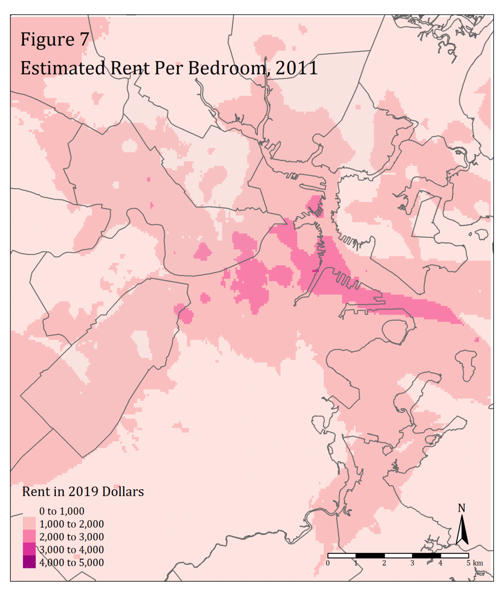

 
 

# Education

MA in Urban and Enviornmental Policy and Planning, 2020

Tufts University

BS in Psychology, 2016

Appalachian State University

 

# About Me

Recent graduate of Tufts University's UEP program focusing on the use of Geographic Information Science and statistical modeling to conduct research and to create useful tool-kits to help policymakers and stakeholders make more informed and environmentally conscious decisions.

 

 

 
 

# Intrest Areas

* Climate Change
* Renewable Energy
* Housing Mobility
* Sustainable Development
* Data Science
* Voter Supression