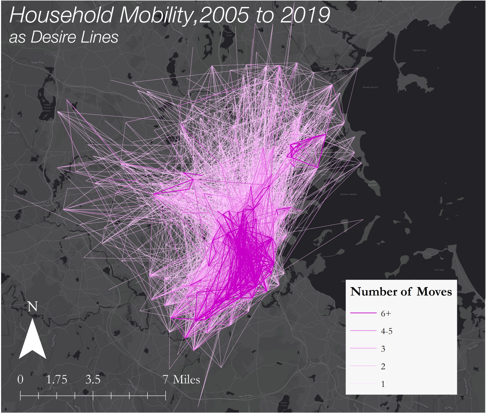
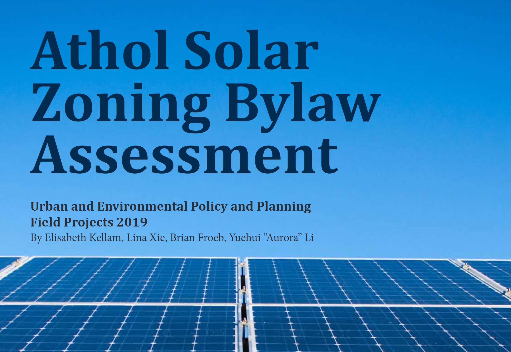

# [Housing Mobility](https://froebbm.github.io/Thesis/)

* Assessed the impact of new development on household mobility between 2005 and 2019
* A novel panel data set on household mobility was created from tax return data and used in logistic regression models
* Additionally tested for any spatial clustering in household mobility through a GIS analysis.
* Conducted as a part of a Master's Thesis that was completed in May 2020
* An interactive app that explores the data and results can be found [here](https://froebbm.shinyapps.io/shiny_thesis/)

# [Renewable Energy](https://tufts.app.box.com/s/ylfgfc6kh01r5h2wq5on5t80nrdkd7n6)

{}

* Member of a research team that investedgated solar development and solar zoning bylaws of the Town of Athol Massachusetts 
* Based on GIS analyses, stakeholder interviews, and comprehensive reviews of comparable town bylaws a model bylaw was proposed for Athol
* Nominated for the Massachusets Chapter of the American Planning Association's Student Project Award
* Led the stakeholder interviews and report layout/design and assisted with the GIS analyses.